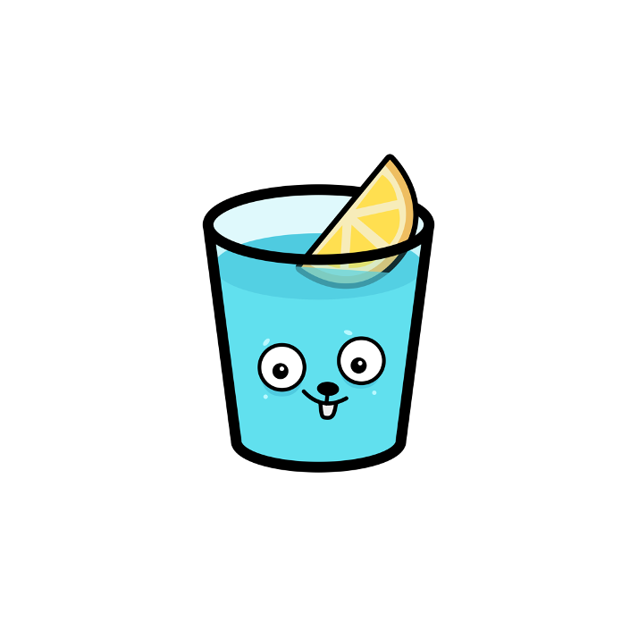

 

    

        
    

    

            <h3><b>HeadHome</b></h3>
            
<i>Your companion, every step of the way</i>

    
      

 
<h1 align="center">HeadHome</h1>

**HeadHome: Your Go-To Dementia Aid Solution**

HeadHome aims to reduce the dangers posed by dementia wandering, and provide the caregivers of our dementia counterparts with an effective means of locating them and safely returning them home.

## Problem Statement
 
<blockquote align='center'>
<h3>“6 in 10 people with dementia will experience wandering episodes.” 

\- Alzheimer's Association
</h3>
</blockquote>
 

With the onset of an ageing population, the prevalence of dementia has risen drastically over the years. People with dementia often **experience confusion, disorientation, and memory loss**, which can cause them to wander away from their homes or care facilities without realising where they are going. Dementia wandering episodes are not only **physically dangerous** for patients, but also **emotionally traumatic** for their caregivers.

## 🛠️ &nbsp;Key Functionalities

1. Dementia Patient

The `Dementia Patient` can request for help from their `Caregiver` and begin the navigation back home by tapping on the red `Navigate Home` button on their home page. The application will also begin navigation when the `Patient` leaves the configurable safezone radius around their home, or when they press the red button the companion wrist wearable device.

This will display a route home on the Google Maps widget. This route will be updated as the patient goes along, rerouting when necessary.

The patient would each have an Authentication ID which is used to ensure that the `Volunteer` will only have access to the `Patient's` home address when they have actually met them. 

2. Caregiver

The `Caregiver` will receive a notification when their respective `Patients` have started to navigate home. This will inform them about the `Patient's` current location, and also allow them to choose to send an SOS alert signal to `Volunteers`. 

The `Caregiver` will then be able to contact the `Volunteers` who have started to guide the `Patient` back home through the `contact` button of the application. 

3. Volunteers

Volunteers would be able to view all nearby SOS alerts, and select the patient they wish to help. The app would provide them with the current location of the patient, and also allow them to redirect to Google Maps to find their way to these caregivers. 

Thereafter, when the volunteers reach the patient, they would be able to start leading them home after verifying the `Patient's` Authentication ID

## 🎯 &nbsp;UN's Sustainable Development Goals & Targets

### SDG 3: Good Health and Well-Being (Target: 3.6)

HeadHome directly addresses the issue of **dementia wandering**.

Wandering episodes can bring danger to patients such as traffic incidents, with no way to contact their caregivers. Thus, caregivers might feel the need to micromanage their patients, causing significant caregiver stress. 

HeadHome can help these patients by providing clear and simple instructions on the wearable to guide the patient home. It also sends alerts to their caregiver whenever they need help, removing the need for constant tracking and monitoring. 

### SDG 11: Sustainable Cities and Communities (Target: 11.a.1)

HeadHome **leverages the power of the community** to improve the lives of dementia patients. Most caregivers have full-time jobs and cannot be with their loved ones 24/7. To ensure that dementia patients can receive help anytime, we will recruit registered volunteers in the community. Caregivers can send out an SOS message to volunteers near the vulnerable patient, who can guide the patients back home. This builds up an inclusive and socially aware community, which can help these patients when they are in need.

## 👨🏻‍💻 &nbsp;Technology Stack

<kbd>

</kbd>
<kbd>

</kbd>
<kbd>

</kbd>
<kbd>

</kbd>
<kbd>

</kbd>
<kbd>

</kbd>
<kbd>

</kbd>
<kbd>

</kbd>
<kbd>

</kbd>

<h4>Flutter | Dart | Firebase | Go | Gin | Google Cloud Platform | Google Maps Platform | Arduino | ESP32</h4>

## 👥 &nbsp;Contributors

|||| 
|--------------------------|--------------------------|--------------------------|--------------------------|
|
<a href="https://github.com/chayhuixiang"><h3><b>Chay Hui Xiang</b></h3></a>
<i>Nanyang Technological University</i>

|
<a href="https://github.com/changdaozheng"><h3><b>Chang Dao Zheng</b></h3></a>
<i>Nanyang Technological University</i>

|
<a href="https://github.com/Trigon25"><h3><b>Marc Chern Di Yong</b></h3></a>
<i>Nanyang Technological University</i>

</a>|
<a href="https://github.com/ongjx16"><h3><b>Ong Jing Xuan</b></h3></a>
<i>Nanyang Technological University</i>

|
